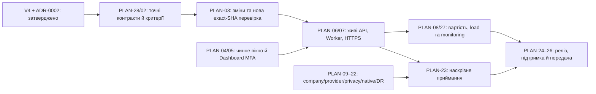

# KNABA DE — план завершення повного продукту

План вже використовується для реалізації погодженої V4. Фактичні поточні зміни та межі доказів: [V4_IMPLEMENTATION_STATUS_UK.md](docs/planning/V4_IMPLEMENTATION_STATUS_UK.md). Статус «реалізовано у вихідному коді» не означає завершене приймання чи working live URL.

Дата базової звірки: **08.10.2026 UTC**; поточне оновлення виконання: **11.10.2026 UTC**. Проєкт окремий від AVENQO. Цільові контракти визначає [KNABA_DE_TARGET_SPEC.md (V4)](KNABA_DE_TARGET_SPEC.md) за явним рішенням користувача. [Оригінальна V3](KNABA_DE_MASTER_SPEC.md) і незаперечені реалізовані функції зберігаються; цей план враховує всі вже збережені зміни й продовжує реалізацію, перевірки, розгортання та передачу компанії. Працюючі модулі зберігаємо; виправлення робимо за конкретною невідповідністю вимозі або відтвореним дефектом.

## Поточне виконання — 11.10.2026 UTC

Опублікований executable **`3f4370c3b3ba66941a42f6840db0f25ae57fca65`**, tree `464057c0a7cea50a7a55eb1d5f88fb95f3203225`, гілка `codex/knaba-v4-sql-recovery-20261011`, [draft PR #5](https://github.com/ziko1/knaba/pull/5). PLAN-03 виконується: внесено вузькі runtime/SQL виправлення та узгоджено regression fixtures з чинними V4-контрактами. Документаційний commit зберігається окремо від цієї tested code SHA.

| Scope | Фактичний стан |
| --- | --- |
| Поточна локальна перевірка | **1 821 CPU/document/explicit-double PASS, 0 FAIL; 407 genuine PostgreSQL SKIP/NOT_RUN**; 2 228 case identities / 89 файлів, TypeScript PASS. |
| Application CI на `3f4370c` | [38097796239](https://github.com/ziko1/knaba/actions/runs/38097796239), job `114347231650`: **SUCCESS**, завершений стан підтверджено **11.10.2026 00:29:15 UTC**. **2 228/2 228 PASS, 0 FAIL, 0 SKIP**, 89 файлів: **1 821 CPU/document/explicit-double та 407 genuine PostgreSQL PASS**. Усі **51 новий PG case** і **40 зіставлень історичних SQL-помилок**, включно з двома явними V4 REWORK replacements, пройшли. |
| Browser/build/recovery/Worker/packaging на `3f4370c` | **27/27 browser PASS**, 26 actual backend/UI + одна HTTP-імітація, 0 FAIL/SKIP/FLAKY. TypeScript/build, Docker, encrypted backup/tamper rejection, restore в окрему DB/private blobs, дві справжні Worker-фази та hosted packaging **PASS**. |
| Native CI на `3f4370c` | [38097796144](https://github.com/ziko1/knaba/actions/runs/38097796144): **SUCCESS**; Android **66 host Java PASS**, debug APK, lint **0 errors / 10 warnings**; iOS **19 actual XCTest PASS**, 0 FAIL/SKIP на iPhone 16 / iOS 18.5 Simulator. Native artifacts/payload hashes, 45 iOS bundle-файлів та actual prepared-device binding незалежно перевірені. |
| Попередній hosted checkpoint `1cbdbdcacb69a03f2fd9e9ad44c3bb358ac619f6` | [38096631407](https://github.com/ziko1/knaba/actions/runs/38096631407) **FAILED**: 2 226/2 228 PASS, 2 FAIL, 0 SKIP; **405/407 genuine PostgreSQL PASS**, усі 51 новий PG case PASS; 27/27 browser, restore і справжні Worker-перевірки PASS. Дві невдалі fixtures виправлено у `3f4370c`, обидва кейси фактично пройшли в новому прогоні; історичний FAILED збережений. |

Точний [execution index](docs/evidence/offline-execution-scope.json): SHA256 `fd14d358f51cb471fcc1061e51602cb03e74f5755d1b172dffa87049c170003a`, executable source manifest SHA256 `0b9e6bdbc6fd82983e1017933e4b8f521f5a97d90b6a0f12c7e8d32c274161d4`. [Фактичний підсумок](docs/evidence/sql-recovery-2026-10-11/README.md), [verification receipt](docs/evidence/sql-recovery-2026-10-11/verification.json) і [native receipt](docs/evidence/sql-recovery-2026-10-11/native-summary.json) фіксують exact source, case mappings та перевірені байти. Незалежно завантажений application evidence artifact `11686537370` має **8 163 623 bytes**, SHA256 `076e43dea4943dee0b304cc1854ee04df8289d6de6cb246557ea454d0d4bcacf`; CRC 113 entries, source/tree та всі 14 built-file hashes збігаються. Повна незалежна передача всього runtime залишається окремим кроком.

Поточні зміни та межі доказів деталізовані в [реєстрі реалізації V4](docs/planning/V4_IMPLEMENTATION_STATUS_UK.md) і [журналі перевірок](docs/TEST_EVIDENCE.md). **Усі 72 compound V4 критерії залишаються NOT_RUN; весь продукт і публічний Railway URL — NOT_READY.** Історичні статуси 475 V3 критеріїв збережені. Успішний scoped CI не приймає D07 source gaps, повний load/latency/RPO/RTO/cost scope чи company/provider/physical/deployment gates.

## Зафіксована вихідна версія

Нижче збережена **історична база звірки 08.10.2026** з повністю перевіреним і переданим executable `ca9ed79ff4c0429223eb60754289ee1132088361`. Її source IDs і результати не перенесені на поточний candidate V4.

| Що | Фактичний стан |
| --- | --- |
| Репозиторій | [ziko1/knaba, knaba-staging](https://github.com/ziko1/knaba/tree/knaba-staging); PR1 draft, main не змінюємо цим планом |
| Перевірений код | `ca9ed79ff4c0429223eb60754289ee1132088361`; локальний еквівалент `4132dbf04b37cc64c3388c3891edce8f44bdf73e`; дерево `8144d5bc90fcefe9bcdb26255d55287e96f2a170` |
| Попередня передана документація | GitHub `e18f293ac1527fff0910a86cd3049bef8bd4a03f`; локально `5747670b4046bbcb365c3e3ab4644b163f07ca42`; цей план є окремою зміною документації |
| Нові зміни в GitHub main | Окремий documentation-only commit `ff748a2e5731e973883344ed28f3e82cf8a3bc06`: V4, 24 розділи, 72 критерії. Application source там не опублікований; PR1 із продуктом лишається draft/unmerged |
| Технічні перевірки | 1513/1513: 1307 CPU/документні/явні імітації та **206 справжніх PostgreSQL**; 0 помилок і пропусків. 24/24 браузерні: **23 із реальним backend/UI**, 1 явна HTTP-імітація |
| Збірка та відновлення | TypeScript/build, 14 перевірених зібраних файлів, реальний Docker, зашифрована копія й відхилення підміни, відновлення в іншу БД **17 таблиць / 10 приватних blobs**, дві фази справжнього Worker — PASSED |
| Мобільні артефакти | Android debug APK, 52 Java-перевірки, lint 0 errors / 8 warnings; iOS simulator app, 15 справжніх XCTest. Байти/підписи/хеші та відхилення підміни перевірені. Company release-signing, IPA й фізичні пристрої — NOT_RUN |
| Збережений регресійний обсяг V3 | **34 модулі / 432 вимоги / 475 складених критеріїв**. Історичні 10 PASSED / 465 NOT_RUN зберігаються; нові технічні тести не означають автоматичного приймання всіх критеріїв |
| Окрема V4-звірка | **V4 затверджена цільовою; наявний стек збережено через ADR-0002.** Усі 72 критерії потребують власного приймання. Перетини й незаперечені V3 regression criteria зіставляє PLAN-28 |
| Railway стан на 08.10 | API OFFLINE, Worker OFFLINE, PostgreSQL CRASHED; **37 змін STAGED, не застосовані**. Виділена адреса `https://api-staging-a476.up.railway.app` — NOT_READY |
| Тестове вікно | Попередній абсолютний cutoff **07.10.2026 20:11:52 UTC уже минув**. Він не продовжений. Саме застосування старого patch не дасть робочого середовища: guard зупинить процеси |

Історичні докази: [application receipt](docs/evidence/ci-run-37544413379-summary.json), [native receipt](docs/evidence/native-run-37544413386-summary.json), [повний журнал](docs/TEST_EVIDENCE.md), [незалежна перевірка доставки](docs/evidence/independent-delivery-ca9ed79.json), [read-only звірка Railway 08.10](docs/evidence/railway-resume-2026-10-08.json). Нові виконання мають окремі SHA та результати у поточному розділі вище; успішний публічний deploy не заявляється.

## Уже реалізоване, що зберігаємо

- Архітектура Node 24 / PostgreSQL 17, API + web/PWA + окремий Worker; typed-команди, поточні права company/site/self/customer, CSRF/MFA/session/revocation, транзакційні business effects + audit + outbox, fencing і idempotency. Гроші — цілі EUR cents, матеріали — цілі базові одиниці; часові події UTC, відображення Europe/Berlin.
- Заявки й операторська передача, прайси/кошториси/зміни, dispatch, клієнтський портал, об'єкти/дерево локацій, реальний CSV/XLSX import, задачі/quality/rework, час/табелі/поїздки, склад/закупівлі, попередня винагорода й записи виплат, документи/звіти та приватні медіа.
- Канали/chat/переклад і офіційні provider adapters; assistant governance, version-bound AI drafts та явне людське підтвердження. Реальні Meta/AI надсилання не активовані тестовими fixtures.
- Нові персональні Activity/unread та **19 причин WEB-повідомлень × 6 мов**, lease/dedup, актуальні source/cause/recipient/ACL й canonical commercial approval events. 28 CPU + 13 справжніх PG перевірок bridge вже пройшли; це не 19 повністю прийнятих компанією бізнес-процесів.
- Morning/day/week digests з Berlin/DST, immutable snapshots, приватною історією та Director UI; фактична періодна статистика, approved time adjustments і latest reviewed trips. 32 CPU + 16 PG уже пройшли.
- Ручна непрозора маска на **новій клієнтській копії фото**, збережені original/prior bytes, lineage, audit, повторне погодження публікації й erasure/holds. 35 CPU + 9 PG пройшли; атомарна редакція працює на PostgreSQL, S3 edit-lifecycle потребує окремої реалізації, якщо компанія обере S3 для цього потоку.
- Privacy/DSAR/quiescence/erasure-ledger safeguards, raw GPS TTL/holds без незмінних копій координат, working-time advisory, scoped SVG route view, native encrypted queue/privacy stop/geofences; real tracking залишається закритим до законних погоджень і фізичних перевірок.
- Точкові виправлення lease-fixture/accessibility, прив'язка справжнього iOS runtime/device та Playwright `captureGitInfo.diff:false`. Packaging secret guard збережений; ca9 artifacts успішно передані. Історичні невдалі запуски з їхніми SHA залишаються в журналі.

## Послідовність до готового продукту

### Етап 0. Застосувати затверджену V4 та завершити точні контракти

У `main` після попередньої передачі з'явилася V4. Її текст, CSV, original document-validation report і checksums збережені як [окреме byte-preserved reference](docs/specification-v4-reference/REFERENCE_PROVENANCE.json); оригінальна прикріплена V3 не перезаписана. V4 PDF/ZIP мають лише reported hashes, їхні binary bytes у цьому продовженні не перевірені.

[Звірка V3 → V4](docs/planning/V3_V4_RECONCILIATION_UK.md) та [72-критерієвий реєстр](docs/planning/V3_V4_RECONCILIATION.json) визначають конкретні параметричні, lifecycle, API та deployment відмінності. Користувач затвердив V4 і збереження NestJS/PostgreSQL SQL/outbox через [ADR-0002](docs/adr/0002-v4-target-and-preserved-runtime.md); [decision receipt](docs/planning/V4_SCOPE_DECISION.json) фіксує точну відповідь. PLAN-28 завершує конкретні parameter/API/lifecycle contracts та зв'язки з існуючими 432/475 ID. Далі PLAN-03 реалізує кожну прийняту зміну й її regression proof; PLAN-02 оцінює весь погоджений обсяг окремо від старих тестів. Не оголошувати V4 виконаною за доказами ca9 і не робити автоматичну міграцію працюючого стеку лише через наявність нового файла.

**Вихід:** кожен із 72 критеріїв має version decision, concrete gap/no-gap з source evidence, related V3 IDs, work package та потрібний доказ. V4 application acceptance зараз NOT_RUN. Продукт і документація V4 знаходяться в різних незлитих гілках; цей план не об'єднує їх і не змінює `main`.

### Етап 1. Приймальна матриця та конкретні дефекти

Підготувати окреме **поточне виконання** для кожного з 72 цільових критеріїв V4 і зіставити 475 критеріїв V3 як regression/history scope: точний текст, середовище, потрібні ролі/дані, кроки, очікуваний результат, вже наявні докази, відсутні частини й залежні EXT-ID. Дані з ca9 можна повторно використати тільки для тих тверджень, які вони реально доводять. Старі статуси та джерела не переписувати; current acceptance додати окремим шаром. Для складеного критерію перелічити й перевірити всі частини.

Відтворити знайдені розриви в повних flow й відкрити конкретні дефекти. Спершу виправляти доступ/витік/цілісність/гроші/час/відновлення, потім блокери бізнес-процесів та UI. Кожне виправлення пов'язати з requirement-ID, відтворенням і regression proof. Не перетворювати вибір зовнішнього сервісу на вигадану архітектурну переробку.

У поточному source виправлено конкретні runtime/SQL дефекти: відповідь асистента перевіряє чинні persisted job/type/data/lease, canonical service account і версії config/channel/message до receipt, provider/tools та фінальної відповіді; відкликане членство не відновлюється. Відомі provider outcomes обліковуються навіть після lease loss, скасування до першого виклику звільняє резерв, невідомий outcome зберігає його. Це **облік за налаштованою оцінкою вартості**, перевірений з явними зовнішніми AI/provider імітаціями; фактичні рахунки провайдера не перевірені. Для зміненого payload з тим самим idempotency key діє V4 `IDEMPOTENCY_CONFLICT`. Fixtures використовують чинні права, canonical IDs, збережені timestamps і незмінні прийняті task/quote facts; handoff окремо доводить відмову без lease та подавлення AI за чинного lease, а перевірка адресатів не залежить від порядку SQL-рядків.

Додано **51 genuine PostgreSQL case**: 29 answer-authority, 16 assistant-runtime, 6 load-seed. Дві семантичні заміни digest на V4 REWORK lifecycle мають точні old→new mappings і причини в [execution index](docs/evidence/offline-execution-scope.json); чотири історичні заміни також збережені. На `1cbdbdc` усі 51 новий case та 39 із 40 раніше невдалих SQL-сценаріїв пройшли, але весь workflow завершився FAILED з двома fixture-помилками. У поточному `3f4370c` **усі 51 новий case, усі 40 historical mappings та обидва залишкові кейси `1cbdbdc` фактично PASS**. [Per-case verification](docs/evidence/sql-recovery-2026-10-11/verification.json) і [історичний FAILED](docs/evidence/sql-recovery-2026-10-11/historical-1cb/verification.json) збережені окремо. Цей scoped execution не є прийманням усіх частин будь-якого compound критерію.

**Вихід:** усі 72 цільові критерії V4 і 475 критеріїв V3 мають коректний version mapping, current assessment та evidence/gap; усі 34 модулі мають пакети робіт. Непройдені критерії лишаються FAILED/NOT_RUN/BLOCKED_EXTERNAL. Цей аудит можна виконувати незалежно від Railway.

### Етап 2. Відновити окреме staging та перевірити його наживо

1. Зафіксувати **нове конкретне дозволене тестове вікно** й контроль витрат до €10/місяць. Попередню авторизацію deploy враховуємо; повторно дозвіл на сам проєкт не просимо. Зміну минулого cutoff без окремо погодженого нового строку не застосовуємо.
2. Після цього оновити тільки cutoff у вже ізольованому проєкті й переглянути весь конкретний patch: ca9 source pins/API/Worker/shared GIT_SHA, Dockerfile, explicit variable references, private DB, resource caps, guarded start, predeploy. Не змінювати чужі проєкти чи workspace billing cap; секрети не публікувати.
3. Railway вимагає **Dashboard MFA/2FA**; обліковий власник застосовує підготовлений актуальний patch у Dashboard. API/MCP не може виконати цю перевірку. Старі 37 staged змін зберігаються як історія; після оновлення треба прочитати фактичну кількість, не припускати, що вона залишиться 37.
4. Прочитати terminal SUCCESS та репліки **кожного** PG/API/Worker, build/predeploy/runtime logs; точково виправити лише фактичну помилку. Перевірити HTTPS, readiness, assets, DEMO, company `knaba-demo` і справжній `/version` SHA.
5. Лише після ready створити staging-target marker. Запустити [verify-staging.mjs](scripts/verify-staging.mjs): власник створює унікальну приватну подію, окремий Employee отримує реальну WEB delivery від окремого Worker; ACL/CSRF/logout і 24 браузерні сценарії повторити проти HTTPS. Наявність домену чи статус queued не є PASS.
6. Зібрати реальні CPU/memory/storage/network/cost метрики. €10/місяць — бюджет, а не доведена ціна: поточні верхні ліміти ресурсів самі не гарантують €10. Якщо фактичний прогноз перевищує бюджет, підготувати менший перевірений sizing або чесно зафіксувати потребу у рішенні; не продовжувати платне середовище мовчки.

**Вихід:** дійсна URL, exact runtime SHA, timestamped live evidence, isolated worker/retry/restart/ACL/browser proof, виміряна вартість і погоджений строк роботи. Public live acceptance зараз NOT_RUN.

### Етап 3. Реальні правила KNABA та end-to-end бізнес-процеси

Налаштувати затверджені company facts, owner/recovery/MFA, ролі й представників клієнтів, прайси/tax/discount mandates, crews/skills/availability, адреси/локації, матеріали/одиниці, pay/travel/time rules, notification recipients і timed REMIND/source policies. Входи отримати за [EXT-01/02/13/14/15/17/18/20](docs/EXTERNAL_PREREQUISITES.md); synthetic fixtures не переносити як справжні тарифи чи повноваження.

Затвердити й виконати ці наскрізні сценарії, пов'язавши **кожен** зі своїми requirement/criterion IDs:

| Flow | Що перевірити до приймання |
| --- | --- |
| Заявка → handoff → quote → acceptance → dispatch | Оригінал/мова, human claim/reclaim, версія ставки/податку, підтвердження клієнта, навички/доступність/material/crew ACK, конфлікт і зміна замовлення |
| Об'єкт → import → task → work → review → rework | Ациклічні локації/реальний файл, scoped права, розподіл команди, progress/continuation, дефект і контроль якості, відмова/повторне погодження |
| Employee shift → break/travel → timesheet → correction | Безперервність часу, приватна перерва, схвалення/adjustment/version, ArbZG guidance з повною історією й погодженими правилами, відсутність автоматичних списань |
| Material request → approval → reserve/issue → use/return | Цілі базові одиниці, shortage, custody, фізичний/транзитний/зарезервований залишок, cost snapshot; жодної несанкціонованої покупки |
| Client Issue → task/rework → report/photo → portal | Повноваження представника, hidden/original vs опублікована копія, маска/reapproval, evidence-based closure, відмова/нова версія; legal Abnahme окремо |
| Approved work → preliminary pay → accountant → payout record → ACK | Точні approved seconds/rate version, погоджені gross/net/import/export, окремі approval/transfer proof/employee statement; app-запис не є банківським переказом |
| Work event → notification/unread → digest | Explicit current recipient, усі потрібні 19 cause families, read vs delivery, current rights/version, lease/retry/dedup, Berlin/DST morning/day/week, immutable history й timed policy |
| Revocation/erasure/hold → worker → backup/restore | Fresh ACL після кешу/replay, rollback/concurrency, quiescence, original/copies/blob lineage, legal holds/TTL, актуальний незалежний erasure ledger, provider/device/offsite fulfillment |

**Вихід:** фактичний company UAT для всієї специфікації, без підміни фізичних/юридичних/provider фактів синтетичними затвердженнями.

### Етап 4. Зовнішні інтеграції та умовні доповнення

| Напрям | Реалізація / перевірка, що лишилася | Умова початку |
| --- | --- | --- |
| Офіційний WhatsApp | Підключити справжні WABA/phone/app/templates; signed webhook, window/template/media, delivery/read/callback/retry/operator handoff на дозволених test recipients; зберегти original/version і audit | EXT-04/05, тільки явні дозволені повідомлення |
| AI/translation/drafts | Затверджені host/model/key/DPA/rates/budget; реальний multilingual/adversarial evaluation, timeout/unknown outcome/minimization, fresh confirmation/revocation. AI не authorizes money/payroll/GPS | EXT-06 та справжні policy/rate facts |
| Storage/scanner | Вибрати production PG/private S3; перевірити ACL/actual clean+infected scan. Якщо потрібен S3 саме для фото-редакції, реалізувати transactional/journaled edit + rollback/quiescence/erasure lifecycle | EXT-08; PG працюючий, S3-edit — CONDITIONAL_NOT_STARTED |
| Backup/DR | Реальна незалежна offsite encrypted copy, key custody, retention/RPO/RTO; повне відновлення DB+media в інше середовище, integrity й current erasure-ledger safeguards, виміряний час | EXT-08, жодного wipe робочої БД |
| XRechnung/ZUGFeRD | Якщо застосовно, погодити точний профіль/версію, реалізувати structured adapter, пройти офіційний/погоджений validator і accountant acceptance. PDF/CSV/XLSX цього не доводять | EXT-19; адаптер зараз не реалізований |
| Accounting/bank/supplier | Дописати лише погоджені adapters/import/export contracts; reconciliation, retries/duplicate/unknown outcomes; реальні transfer/order тільки за конкретною дозволеною дією | EXT-15/16/17; app вже записує statements/ledger, не виконує bank transfers |
| External map/navigation | Потрібне лише якщо обрано зовнішні tiles/ETA/navigation: approved key/region/quota/privacy, attribution, field route | EXT-07; scoped SVG без зовнішніх tiles уже є |

Умовні пакети закриваються лише реалізацією й доказом або **погодженим рішенням про незастосовність конкретної вимоги**. Не виключати функцію зі специфікації заради зеленого релізу; непотрібний зовнішній provider не робити обов'язковим.

### Етап 5. Privacy/legal, підписані native та фізичні сценарії

До real GPS — EXT-09: purpose/necessity/legal basis/notice/alternatives/retention/appeal, DPIA/works council де застосовно, чотири scoped approvals, expiry/revocation. Legal/tax/pay/Abnahme текст затверджує відповідальний KNABA reviewer. Privacy fulfillment перевірити не тільки в active DB: provider processors, незалежні backups та зареєстровані devices.

Android: company keystore/upgrade identity, release APK/AAB, signature/hash/install/upgrade. iOS: Apple team/provisioning/entitlements, signed export IPA/TestFlight, install/upgrade. На дозволених реальних Android/iPhone виконати foreground/locked-screen/background, force-stop/reboot, permission denied/revoked, offline/reconnect/duplicate, encrypted queue/privacy stop, geofence/route/timezone/battery/OS behavior. Документувати фактичні обмеження ОС; не обіцяти delivery після force-stop, коли ОС його забороняє. Шість мов перевірити на телефонах, private-data logout/cache та UI доступність — також.

**Вихід:** company-signed установлювані артефакти + device/OS/version/timestamp/result/evidence, законна активована GPS configuration, відсутність непояснених витоків і прийняті фізичні обмеження. Debug APK/simulator tests ці кроки не замінюють.

### Етап 6. Точний реліз, production і передача

Кожна **зміна executable/committed config/contract/test/toolchain/native** після ca9 створює нову candidate SHA: scoped meaningful regressions, full applicable hosted PG/browser/typecheck/build/container/recovery/worker/packaging та потрібні native повтори виконуються на цьому джерелі. Зміна лише зовнішньої deployment-конфігурації, наприклад погодженого cutoff, залишає code SHA незмінною: зберегти окремий configuration digest/redacted read-back та виконати потрібні живі перевірки. Docs-only commit не ретегує ca9 runtime. У manifest відокремити code Git SHA, docs Git SHA, configuration digest, tree/image/file hashes і deployed SHA; secret guard не вимикати.

Виконати load/observability пакет за затвердженим V4 KNB-23: 100 працівників, 20 активних об’єктів, 100 одночасних сесій, 10 команд/с протягом 15 хвилин на 100 000 TimeSegments. Цілі: core API p95 ≤1 с / p99 ≤3 с, 0 втрачених підтверджених команд, <1% 5xx; durable webhook p95 ≤2 с; enqueue→provider request p95 ≤5 с; PDF ≤60 с для 50 задач / 20 оптимізованих фото за 3 паралельних jobs. План відновлення має досягти DB/metadata RPO ≤15 хвилин, media RPO ≤24 години й RTO ≤4 години. Записати ресурси, seed, інтервал та raw-safe результати; усі ці вимірювання зараз NOT_RUN. Додаткові метрики V3 §30.9 — queue backlog/age, duplicate rates, chat reconnect, physical geolocation latency/battery — збережені; фізичні сценарії потребують пристроїв з Етапу 5. Перевірити monitor/alert/incident і rollback drill.

Core load runner та окремий CI job уже є. У [seed CTE](scripts/v4-load.mts) виправлено неоднозначний SQL-параметр через `$4::text`; [шість genuine PostgreSQL regression cases](tests/v4-load-seed.integration.test.ts) мають **6/6 actual PASS на поточному `3f4370c`**, application run 38097796239 **SUCCESS**. Попередні 6/6 PASS на `1cbdbdc` у run 38096631407 збережені як історія. Це перевірки seed і його транзакційних фактів. **Повний 900-секундний профіль / 100 sessions / 100 000 TimeSegments, latency/SLO, RPO/RTO та фактична вартість залишаються NOT_RUN**; ці значення не виводяться із шести малих SQL-тестів або вже пройденого restore.

Production release дозволяється після живого staging, успішного company UAT, всіх застосовних provider/legal/device/DR gates, перевіреного budget/SLO і операційного власника. Окремо визначити production/merge decision — staging дозвіл не є автоматичним дозволом merge чи використання реальних персональних даних. Перед запуском підготувати конкретний reviewable release/change/rollback пакет; зберігати originals/business history й безпечні migration/rollback boundaries.

**Вихід:** справжні робочі URLs і `/version`, точна code/documentation/runtime SHA, підписані mobile distributions, перевірені архіви/manifests, 34-module readiness, current 475-criterion results, user/admin/API/DevOps/recovery docs, доступи в secret manager, named owner/support/incident contacts, actual backup/restore/sizing/cost evidence. Відкрита обов'язкова вимога блокує заяву «повністю готово»; конкретні погоджені обмеження мають свій документований статус.

## Пакети робіт та повне покриття модулів

Детальний залежний backlog з owner/dependencies/exit evidence/status і зв'язками з **усіма 432 requirement IDs / 475 criterion IDs / 34 модулями**, а також окремою V4-звіркою 72 критеріїв: [DEVELOPMENT_BACKLOG.json](docs/planning/DEVELOPMENT_BACKLOG.json). Текст задач — план, не доказ виконання. Єдиний перелік зовнішніх входів зберігається в [EXTERNAL_PREREQUISITES.md](docs/EXTERNAL_PREREQUISITES.md); не заводимо другий суперечливий список.

| Пакет | Результат роботи | Поточний стан | Попередники |
| --- | --- | --- | --- |
| PLAN-01 | Зберегти перевірений код, документацію та передані артефакти | Базові докази PASSED | — |
| PLAN-02 | Оцінити 72 цільові критерії V4 та повні регресії V3 | NOT_RUN / заплановано | PLAN-01, PLAN-28 |
| PLAN-03 | Точкові виправлення підтверджених прогалин і дефектів | Виконання **IN_PROGRESS**; scoped SQL/runtime на `3f4370c` **PASS**, 407/407 PG; повне приймання відкрите | PLAN-02 |
| PLAN-04 | Погодити нове обмежене staging-вікно та контроль бюджету | Залежить від зовнішнього входу | PLAN-01 |
| PLAN-05 | Застосувати актуальні зміни через MFA у Railway Dashboard | Залежить від зовнішнього входу | PLAN-04 |
| PLAN-06 | Отримати працюючі API, PostgreSQL і Worker | NOT_RUN / заплановано | PLAN-05 |
| PLAN-07 | Живі HTTPS, доставка окремим Worker та 24 браузерні сценарії | NOT_RUN / заплановано | PLAN-06 |
| PLAN-08 | Виміряти вартість і підтвердити розмір ресурсів у бюджеті | NOT_RUN / заплановано | PLAN-06 |
| PLAN-09 | Затвердити дані компанії, повноваження й реальні правила | Залежить від зовнішнього входу | PLAN-01 |
| PLAN-10 | Прийняти офіційний WhatsApp на дозволених тестових номерах | Залежить від зовнішнього входу | PLAN-06, PLAN-09 |
| PLAN-11 | Реальні AI, переклад і чернетки з оцінкою приватності та якості | Залежить від зовнішнього входу | PLAN-06, PLAN-09 |
| PLAN-12 | Зовнішні карти, навігація й ETA, якщо потрібні | Умовна реалізація / рішення | PLAN-06, PLAN-09 |
| PLAN-13 | Атомарне редагування клієнтського фото на S3, якщо обрано | Умовна реалізація / рішення | PLAN-02, PLAN-09 |
| PLAN-14 | Незалежна резервна копія, контроль ключів і відновлення | Залежить від зовнішнього входу | PLAN-06, PLAN-09 |
| PLAN-15 | Структуровані рахунки XRechnung/ZUGFeRD, якщо застосовно | Умовна реалізація / рішення | PLAN-02, PLAN-09 |
| PLAN-16 | Погоджені адаптери бухгалтерії, банку й постачальників | Умовна реалізація / рішення | PLAN-02, PLAN-09 |
| PLAN-17 | Погодити одержувачів, 19 причин повідомлень і timed REMIND | Залежить від зовнішнього входу | PLAN-06, PLAN-09 |
| PLAN-18 | Законна конфігурація GPS та чотири незалежні погодження | Залежить від зовнішнього входу | PLAN-09 |
| PLAN-19 | Повне виконання privacy/DSAR через провайдерів, копії й пристрої | Залежить від зовнішнього входу | PLAN-06, PLAN-09, PLAN-14, PLAN-18, PLAN-22 |
| PLAN-20 | Підписання й поширення Android від імені компанії | Залежить від зовнішнього входу | PLAN-09 |
| PLAN-21 | Підписання й поширення iOS від імені компанії | Залежить від зовнішнього входу | PLAN-09 |
| PLAN-22 | Фізичні Android/iPhone перевірки GPS, фону, офлайн і батареї | Залежить від зовнішнього входу | PLAN-07, PLAN-18, PLAN-20, PLAN-21 |
| PLAN-23 | Приймання компанією наскрізних бізнес-процесів | NOT_RUN / заплановано | PLAN-02, PLAN-03, PLAN-07, PLAN-09, PLAN-10, PLAN-11, PLAN-14, PLAN-17, PLAN-18, PLAN-19, PLAN-22 |
| PLAN-24 | Точний production release та пакет змін і rollback для перевірки | NOT_RUN / заплановано | PLAN-23, PLAN-08, PLAN-27, PLAN-25, PLAN-28 |
| PLAN-25 | Контроль активів компанією та відповідальні за експлуатацію | Залежить від зовнішнього входу | PLAN-09, PLAN-08, PLAN-14 |
| PLAN-26 | Фінальна передача продукту з фактичними URL, SHA та артефактами | NOT_RUN / заплановано | PLAN-24, PLAN-25 |
| PLAN-27 | Вимірювання навантаження, SLO та перевірка моніторингу | Core runner реалізований; seed **6/6 PG PASS**; повні вимірювання **NOT_RUN** | PLAN-06 |
| PLAN-28 | Завершити узгодження цільової V4 з реалізацією та регресіями V3 | NOT_RUN / заплановано | PLAN-01 |

| Модуль із канонічної матриці | Вимог / критеріїв | Пакети завершення |
| --- | --- | --- |
| delivery/specification | 4 / 4 | PLAN-01, PLAN-02, PLAN-03, PLAN-23, PLAN-24, PLAN-26, PLAN-28 |
| delivery/product | 7 / 7 | PLAN-01, PLAN-02, PLAN-03, PLAN-04, PLAN-06, PLAN-08, PLAN-23, PLAN-24, PLAN-26, PLAN-28 |
| delivery/autonomy | 9 / 9 | PLAN-01, PLAN-02, PLAN-03, PLAN-04, PLAN-05, PLAN-23, PLAN-24, PLAN-26, PLAN-28 |
| approvals/automations | 6 / 6 | PLAN-01, PLAN-02, PLAN-03, PLAN-09, PLAN-17, PLAN-23, PLAN-24, PLAN-26, PLAN-28 |
| architecture | 8 / 8 | PLAN-01, PLAN-02, PLAN-03, PLAN-06, PLAN-23, PLAN-24, PLAN-26, PLAN-28 |
| identity/rbac | 21 / 21 | PLAN-01, PLAN-02, PLAN-03, PLAN-06, PLAN-07, PLAN-09, PLAN-23, PLAN-24, PLAN-25, PLAN-26, PLAN-28 |
| channels/conversation-router | 11 / 11 | PLAN-01, PLAN-02, PLAN-03, PLAN-07, PLAN-10, PLAN-23, PLAN-24, PLAN-26, PLAN-27, PLAN-28 |
| integrations/whatsapp | 9 / 9 | PLAN-01, PLAN-02, PLAN-03, PLAN-10, PLAN-23, PLAN-24, PLAN-26, PLAN-28 |
| messaging/translation | 17 / 17 | PLAN-01, PLAN-02, PLAN-03, PLAN-10, PLAN-11, PLAN-19, PLAN-23, PLAN-24, PLAN-26, PLAN-28 |
| assistant-config/knowledge | 11 / 11 | PLAN-01, PLAN-02, PLAN-03, PLAN-11, PLAN-23, PLAN-24, PLAN-26, PLAN-28 |
| leads/handoff | 10 / 10 | PLAN-01, PLAN-02, PLAN-03, PLAN-10, PLAN-11, PLAN-23, PLAN-24, PLAN-26, PLAN-28 |
| pricing/quotations | 10 / 10 | PLAN-01, PLAN-02, PLAN-03, PLAN-09, PLAN-15, PLAN-23, PLAN-24, PLAN-26, PLAN-28 |
| dispatch/scheduling | 8 / 8 | PLAN-01, PLAN-02, PLAN-03, PLAN-09, PLAN-17, PLAN-23, PLAN-24, PLAN-26, PLAN-28 |
| client-portal | 8 / 8 | PLAN-01, PLAN-02, PLAN-03, PLAN-09, PLAN-23, PLAN-24, PLAN-26, PLAN-28 |
| sites/site-locations | 8 / 8 | PLAN-01, PLAN-02, PLAN-03, PLAN-09, PLAN-12, PLAN-23, PLAN-24, PLAN-26, PLAN-28 |
| tasks/quality/rework | 17 / 17 | PLAN-01, PLAN-02, PLAN-03, PLAN-07, PLAN-17, PLAN-23, PLAN-24, PLAN-26, PLAN-28 |
| timekeeping | 7 / 7 | PLAN-01, PLAN-02, PLAN-03, PLAN-09, PLAN-18, PLAN-22, PLAN-23, PLAN-24, PLAN-26, PLAN-28 |
| geolocation/geofences/travel/native | 44 / 44 | PLAN-01, PLAN-02, PLAN-03, PLAN-12, PLAN-18, PLAN-19, PLAN-20, PLAN-21, PLAN-22, PLAN-23, PLAN-24, PLAN-26, PLAN-27, PLAN-28 |
| reporting/statistics | 10 / 10 | PLAN-01, PLAN-02, PLAN-03, PLAN-17, PLAN-23, PLAN-24, PLAN-26, PLAN-28 |
| inventory/procurement | 30 / 30 | PLAN-01, PLAN-02, PLAN-03, PLAN-09, PLAN-16, PLAN-23, PLAN-24, PLAN-26, PLAN-28 |
| notifications/automations | 10 / 10 | PLAN-01, PLAN-02, PLAN-03, PLAN-07, PLAN-10, PLAN-17, PLAN-23, PLAN-24, PLAN-26, PLAN-27, PLAN-28 |
| media | 7 / 7 | PLAN-01, PLAN-02, PLAN-03, PLAN-13, PLAN-14, PLAN-19, PLAN-23, PLAN-24, PLAN-26, PLAN-28 |
| payroll/payouts | 8 / 8 | PLAN-01, PLAN-02, PLAN-03, PLAN-09, PLAN-16, PLAN-23, PLAN-24, PLAN-26, PLAN-28 |
| reporting/documents | 12 / 12 | PLAN-01, PLAN-02, PLAN-03, PLAN-07, PLAN-09, PLAN-13, PLAN-15, PLAN-16, PLAN-23, PLAN-24, PLAN-26, PLAN-27, PLAN-28 |
| bot-admin | 24 / 24 | PLAN-01, PLAN-02, PLAN-03, PLAN-07, PLAN-09, PLAN-11, PLAN-17, PLAN-23, PLAN-24, PLAN-26, PLAN-28 |
| web/pwa/widget/native | 8 / 8 | PLAN-01, PLAN-02, PLAN-03, PLAN-07, PLAN-12, PLAN-20, PLAN-21, PLAN-22, PLAN-23, PLAN-24, PLAN-26, PLAN-28 |
| privacy/ai | 7 / 7 | PLAN-01, PLAN-02, PLAN-03, PLAN-11, PLAN-12, PLAN-13, PLAN-14, PLAN-18, PLAN-19, PLAN-22, PLAN-23, PLAN-24, PLAN-26, PLAN-28 |
| legal/policies | 13 / 13 | PLAN-01, PLAN-02, PLAN-03, PLAN-09, PLAN-11, PLAN-15, PLAN-18, PLAN-19, PLAN-23, PLAN-24, PLAN-25, PLAN-26, PLAN-28 |
| security/resilience | 11 / 11 | PLAN-01, PLAN-02, PLAN-03, PLAN-06, PLAN-08, PLAN-13, PLAN-14, PLAN-16, PLAN-19, PLAN-20, PLAN-21, PLAN-23, PLAN-24, PLAN-25, PLAN-26, PLAN-27, PLAN-28 |
| domain/contracts | 17 / 17 | PLAN-01, PLAN-02, PLAN-03, PLAN-15, PLAN-16, PLAN-23, PLAN-24, PLAN-26, PLAN-28 |
| acceptance/quality | 22 / 65 | PLAN-01, PLAN-02, PLAN-03, PLAN-07, PLAN-22, PLAN-23, PLAN-24, PLAN-26, PLAN-27, PLAN-28 |
| delivery/documentation | 11 / 11 | PLAN-01, PLAN-02, PLAN-03, PLAN-23, PLAN-24, PLAN-25, PLAN-26, PLAN-28 |
| infra/deployment | 18 / 18 | PLAN-01, PLAN-02, PLAN-03, PLAN-04, PLAN-05, PLAN-06, PLAN-07, PLAN-08, PLAN-14, PLAN-23, PLAN-24, PLAN-25, PLAN-26, PLAN-27, PLAN-28 |
| handover | 9 / 9 | PLAN-01, PLAN-02, PLAN-03, PLAN-08, PLAN-14, PLAN-20, PLAN-21, PLAN-23, PLAN-24, PLAN-25, PLAN-26, PLAN-28 |

## Порядок виконання та правила готовності

Першими виконуються PLAN-28 (V3/V4 version/contract reconciliation), PLAN-02/03 (повна current acceptance й triage) та підготовка PLAN-04/05 (актуальне дозволене вікно й Dashboard); незалежно збираються компанійні конфігурації PLAN-09, provider contracts і signing. Після ready відразу PLAN-07/08 (живі сценарії й вартість). Company flows/інтеграції/фізичні перевірки йдуть паралельно за залежностями. PLAN-23/24/25/26 — фінальні ворота UAT/release/operating ownership/delivery.

Версію V4 і збереження стеку вже затверджено. Поки окремі контракти PLAN-28 уточнюються, можна й потрібно готувати індивідуальні оцінки незаперечених критеріїв V3, відтворення дефектів, regression cases та patch для staging. Залежність PLAN-02 від PLAN-28 блокує остаточне приймання узгодженого обсягу, а не ці незалежні чернеткові перевірки. Неоднозначні окремі контрактні рішення уточнювати; затвердження цільової V4 і збереження стеку повторно не запитувати.

Строки зовнішніх погоджень, MFA, ключів і фізичних пристроїв невідомі; календарну дату «готово» не вигадуємо. Для кожного виконання зберігаємо actual environment, code SHA, час, steps/result/raw-safe evidence та related criterion IDs. Після зміни статусу оновлюємо цей backlog, [матрицю](docs/requirements/requirements.json), [module readiness](docs/requirements/MODULE_READINESS.md), [PROJECT_MEMORY.md](PROJECT_MEMORY.md), [roadmap](MASTER_ROADMAP.md) і [TEST_EVIDENCE.md](docs/TEST_EVIDENCE.md), не стираючи історію.

Повна готовність означає прийняті 72 цільові критерії V4 та незаперечений реалізований обсяг V3, робочі живі сценарії, реальні необхідні інтеграції, контроль приватності/доступу/часу/грошей, відновлення й бюджет, встановлювані підписані мобільні клієнти з фізичною перевіркою та передачу підтримуваного продукту KNABA. Історичні 1 513 тестів ca9 і поточні scoped regression results є технічними доказами лише свого виконаного обсягу; повна готовність потребує всіх перелічених приймальних результатів.
