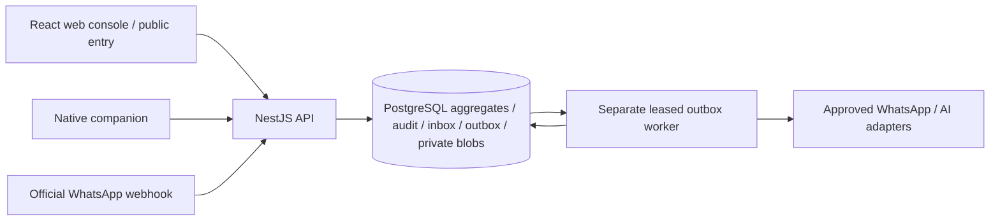

# Architecture

The system is an isolated, single-company-first **modular monolith with a separate worker**, retaining `companyId` on all authoritative data. The [V3 specification](../KNABA_DE_MASTER_SPEC.md), [engineering rules](../AGENTS.md) and [ADR 0001](adr/0001-architecture.md) describe the design intent. This document states current implementation, including the selectable private PostgreSQL/S3 storage adapters.

## Runtime and boundaries

| Component | Current implementation |
| --- | --- |
| Runtime | Node 24.19.0; TypeScript 5.9.2 strict; committed npm lockfile |
| HTTP | NestJS 11.1.6 / Express 5.1.0; same-origin web/API; Helmet; typed failure filter |
| Web | React 19.1.1 / Vite 7.1.7; public entry, staff console, customer portal, installable manifest; minimal static-only service worker |
| Database | PostgreSQL; deployment image 17.6; `pg` 8.16.3 SQL adapter; no Prisma runtime |
| Queue | PostgreSQL durable outbox leases, `FOR UPDATE SKIP LOCKED`; no Redis/BullMQ dependency or second business source of truth |
| Validation | Zod 3.25.76 command schemas; authorized JSON Schema/OpenAPI projection via zod-to-json-schema 3.24.6 |
| Media/documents | Private PostgreSQL or S3 originals/client copies/artifacts; Sharp bounded image re-encoding; configured ClamAV INSTREAM for PDF input; PDFKit with embedded licensed font, real OOXML XLSX and CSV |
| MFA | OTPAuth 9.4.0; encrypted TOTP secrets and replay counter |
| Native | Kotlin Android and SwiftUI iOS source, versioned server protocol, encrypted bounded queues and explicit local privacy stop; build/signing/device evidence remains separate |

Direct SQL and transactional PostgreSQL outbox are deliberate choices; there is no Redis queue or ORM runtime. `createPrivateBlobStore` selects S3 explicitly when `S3_BUCKET` is set and otherwise PostgreSQL. S3 writes use tenant-prefixed opaque keys, conditional creation and server-side encryption; both adapters validate owner, MIME and SHA. Configured S3 failures remain failures. Real bucket policy, credentials and offsite restoration require EXT-08 evidence; synthetic adapter fixtures establish only adapter behavior.

`packages/domain` owns deterministic business state and invariants. `apps/api/engine.ts` executes commands and scoped projections. `packages/integrations` validates provider boundaries. `apps/worker` consumes committed events and isolates network failures. `apps/web` renders authorized data/forms; it cannot authorize state changes. Native apps collect only permitted evidence; the server decides accepted time, state, permissions and quantities.

## Command transaction

The executor validates a strict schema and idempotency key, then opens a SERIALIZABLE transaction under a company advisory lock. It reloads the actor's active identity, roles, explicit rights, assignments and memberships before enforcing the command permission and high-risk MFA in PRODUCTION. The handler validates object references, business states, expected versions and site/self/customer/warehouse constraints.

Aggregate changes, immutable revision rows, audit records, command receipt and outbox events commit together. Repeated logical input returns the stored result; reuse of a key for a changed command/input/version conflicts. Receipt reuse also checks the current authorization fingerprint, so a revoked role/channel cannot receive a cached old result. Same-company advisory serialization intentionally trades throughput for clear cross-aggregate invariants in the first release. Load capacity is not established by this design; measure it before growing beyond one-company traffic.

## Asynchronous effects

The API acknowledges a signed WhatsApp webhook only after durably inserting the inbox and outbox reference. Worker leases are bounded, renewed and compared at completion; expired leases can be recovered. Technical retries are bounded with exponential backoff; policy failures remain typed failures. Domain effects use stable idempotency keys. Typed routine automation can prepare drafts/recommendations/reminders; it cannot publish reports, pay people, authorize GPS or execute arbitrary commands.

An external HTTP send can succeed immediately before a process failure. Meta's API does not establish exactly-once delivery; an uncertain provider outcome needs reconciliation rather than an invented delivery claim or blind resend. SENT/DELIVERED/READ are separate from provider acceptance and customer acknowledgments. See [integration details](INTEGRATIONS.md).

## Security and privacy boundaries

Authentication uses scrypt passwords, opaque session hashes, HttpOnly SameSite cookies, same-origin checks and a session-bound CSRF header. PRODUCTION requires configured encryption/origin/exact SHA and rejects demo login. High-risk commands require recent MFA; TOTP secrets are encrypted and consumed counters prevent replay. One-time invitations and device enrollments expire; role changes, disablement and replacement revoke old access.

Company records are scoped in every database transaction. Read projections default deny unfamiliar kinds. Site/self/warehouse scopes and current customer/channel memberships restrict data further. Exact permission strings are the authority; roles do not create wildcards or implicit payroll/raw-location rights. Customer reports expose published snapshots and approved media rather than draft inputs, salaries, bank details, private breaks or raw routes. Authorization applies again at downloads, callbacks, worker execution and event streams. Audit protects technical history; it is not proof of legal authority.

AI receives only authorized, currently approved context and configured budgets/transfer approvals. It cannot calculate contractual prices, modify payroll, rank workers or activate tracking. HANDOFF_PENDING/HUMAN_ACTIVE suppress pending AI answers; translation of an authorized original is a separate operation. Provider failure preserves the original and opens a human path.

The browser does not collect GPS. Native tracking requires an active employee/device/shift, a bounded lease and four effective legal approval records. SITE_PRESENCE sends minimal events; BUSINESS_TRAVEL can send authorized trip points; PRIVATE_BREAK/OFF stops collection. Missing, inaccurate or delayed observations remain uncertain evidence and do not establish misconduct or an automatic wage deduction.

## Build, release and failure recovery

`npm run build` runs strict typing, builds the web assets and bundles independent API/worker entry points plus a release manifest. The server embeds web assets and its build SHA; runtime migration/schema are versioned. Both processes must use the same company/mode/database configuration. Readiness distinguishes a responsive process from a migrated, initialized application. No production deployment is claimed until its reported SHA matches the tested artifact.

Encrypted backup/restore tooling exists, including isolated destination guards and checksums. Record an actual complete database/media restore, reboot behavior and offsite copy before asserting disaster-recovery readiness. A local backup beside the primary database is not an independent failure domain. The [external prerequisites](EXTERNAL_PREREQUISITES.md) own company hosting, key custody, retention/RPO/RTO and alert recipients.

Known limits: coarse company locking and unmeasured production capacity; restricted scheduler syntax; no accepted structured E-Rechnung/accountant/bank/supplier integration; unverified native builds/physical conditions and live providers. S3, XLSX and PDF scanner code exists, but the real S3/scanner endpoint acceptance remains NOT_RUN. Environment socket restrictions and Railway account capacity currently block final runtime/public acceptance. These remain in [the roadmap](../MASTER_ROADMAP.md), not hidden in deployment flags.

GPS retention uses a separate deletable PostgreSQL table, rather than placing raw coordinates in immutable business revisions. The worker performs bounded company-scoped cleanup; exact read expiry closes immediately even before cleanup. Restore applies the current schema, fails closed for legacy raw copies and drains eligible expired points before reporting usable success. Company-specific legal policy and real SQL/physical acceptance remain separate prerequisites.

## Current bounded companion workflows

A private internal-assistant request is distinct from a business task/report/
material request. Provider output remains an owner-scoped preview until an
explicit human confirmation invokes the existing canonical handlers. Its
source, current context, legal transfer policy, lease and category budget are
server authorities. Uncertain provider requests remain in flight for privacy
and budget purposes; outbox failure alone is not evidence of quiescence.

Operator discovery exposes pending opaque channel IDs/versions before claim;
only an atomic current-authority/version claim adds the operator's bounded
channel membership. Resume removes that claim membership. Read-only assistant
usage/playground use database READ ONLY, independently of the UI controls.

The route map consumes only scoped server projections and draws separate
measured segments with gaps/expiry. It has no external tiles or browser GPS.
Working-time advisories preserve intervals and pay, state uncertainty and
require company legal review. Native six-language shift cards consume the
self-only server summary independently of tracking permission.

A Docker build context intentionally excludes .git. Its release receipt states
source_dirty:null and source_provenance:PINNED_CONTAINER_CONTEXT, rather than
claiming an observed clean worktree. GitHub builds separately attest the clean
Git tree; Railway is pinned to that exact commit and live verification checks
the declared runtime SHA/assets. The worker starts only after the private API
reports the same expected source and readiness. A new hosted CI step builds
the actual Railway Dockerfile and executes this worker source contract.
